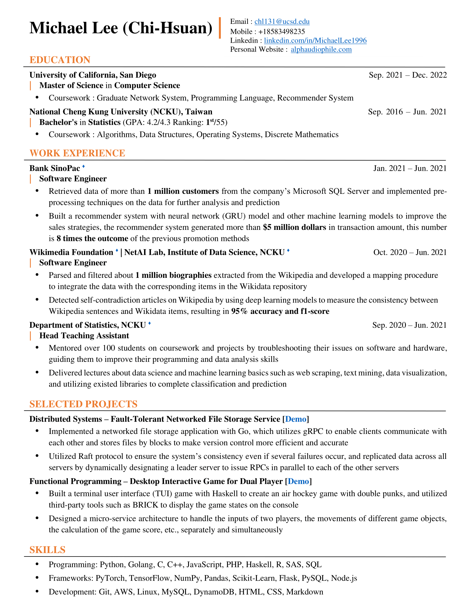

# Intro
- 🔱 Hi, I’m Michael, a current Master student in Computer Science at [University of California, San Diego (UCSD)](https://cse.ucsd.edu/).
- 👀 I’m actively seeking 2022 SDE/ML/DS summer internship.
- 🎵 By the way, I'm also an Audiophile and Melophile.
- 📫 [email](mailto:chl131@ucsd.edu)
- 🔗 [Linkedin](https://www.linkedin.com/in/michaellee1996)

# Experience
- Software Engineer @ [Bank SinoPac](https://bank.sinopac.com/)
- Software Engineer @ [Wikimedia Foundation](https://wikimediafoundation.org/) | [NetAI Lab, Institute of Data Science, NCKU](https://sites.google.com/view/chengteli/home)
- Head Teaching Assistant @ [Department of Statistics, National Cheng Kung University](http://www.stat.ncku.edu.tw/index.php?lang=en)

# Details

<!---
chl131/chl131 is a ✨ special ✨ repository because its `README.md` (this file) appears on your GitHub profile.
You can click the Preview link to take a look at your changes.
--->
